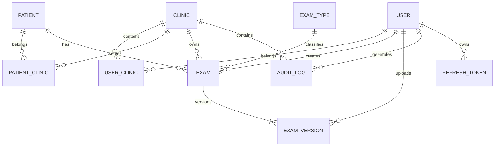
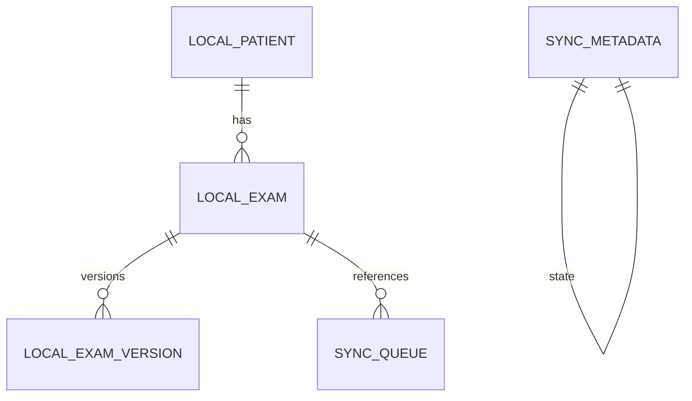

# Resumen proyectos 4 integrantes

**User:** Anonymous  
**Created:** 8/14/2026 10:02:48  
**Updated:** 9/3/2026 9:56:35  
**Exported:** 9/3/2026 10:16:02  

## Response:
Perfecto. Con la libertad que ahora tienen para cerrar el alcance, conviene dejar una **versión base formal del proyecto** y usarla después como fuente para el informe, arquitectura, GitHub Projects y planificación.

Voy a asumir como decisiones ya tomadas:

- Proyecto académico autónomo inspirado en el contexto de WellQ; **sin integración con la plataforma WellQ real**.
- 9 semanas.
- 4 integrantes.
- Web clínica + aplicación Android.
- iOS fuera del alcance.
- Monolito modular.
- Backend: **NestJS + TypeScript**.
- Web: **React + TypeScript + Vite**.
- Android: **React Native + Expo + TypeScript**.
- BD central: **PostgreSQL**.
- BD local Android: **SQLite**.
- Archivos: API compatible con S3, usando **MinIO en desarrollo** y dejando intercambiable el proveedor de producción.
- Docker para desarrollo.
- Railway para despliegue de API, Web y PostgreSQL.
- Monorepo GitHub + GitHub Projects + GitHub Actions.
- JWT + RBAC + aislamiento multitenant por clínica.

---

# 1. Nombre propuesto

## WellQ Medical Records — Gestión Multitenant de Exámenes Médicos

Puede mantenerse administrativamente como **“WellQ App Exámenes Médicos”**, pero en la documentación sugiero añadir un subtítulo:

> **Plataforma web y móvil para la gestión segura y trazable de exámenes médicos en clínicas de rehabilitación.**

Esto evita afirmar que están desarrollando directamente sobre el producto comercial existente de WellQ.

---

# 2. Descripción general

WellQ Medical Records será una plataforma orientada a clínicas de rehabilitación que permitirá centralizar los documentos médicos asociados a sus pacientes, tales como exámenes de laboratorio, informes médicos, estudios de imagenología y documentos de derivación.

La solución estará compuesta por:

1. Una **aplicación web** utilizada por personal clínico y administradores.
2. Una **aplicación móvil Android** utilizada principalmente por pacientes.
3. Una **API REST centralizada**.
4. Una base de datos PostgreSQL.
5. Un almacenamiento de objetos para documentos.
6. Una base SQLite local en la aplicación móvil para soportar caché, metadatos y sincronización diferida.

La arquitectura será multitenant: una única instancia de la aplicación podrá atender a múltiples clínicas, manteniendo separación lógica de sus datos.

---

# 3. Alcance

## 3.1 Alcance incluido

La solución permitirá:

- registrar múltiples clínicas;
- administrar usuarios asociados a cada clínica;
- manejar roles de sistema;
- registrar pacientes;
- asociar pacientes con clínicas;
- permitir acceso clínico a los pacientes correspondientes;
- registrar metadatos de exámenes médicos;
- subir archivos PDF, JPEG y PNG;
- consultar y descargar documentos;
- visualizar el historial documental de un paciente mediante una línea de tiempo;
- clasificar exámenes por tipo;
- mantener múltiples versiones de un mismo examen;
- realizar borrado lógico;
- mantener trazabilidad de accesos y operaciones;
- aplicar aislamiento multitenant;
- permitir que el paciente consulte y cargue documentos desde Android;
- mantener información local en SQLite para mejorar la experiencia móvil;
- sincronizar información entre la app Android y el backend;
- documentar la API mediante OpenAPI/Swagger;
- desplegar el sistema mediante integración continua.

## 3.2 Fuera del alcance

Quedan explícitamente fuera:

- aplicación iOS;
- integración con el producto comercial WellQ;
- integración con sistemas hospitalarios;
- HL7/FHIR productivo;
- interpretación clínica automática de resultados;
- diagnóstico mediante IA;
- extracción OCR como requisito obligatorio;
- procesamiento de imágenes médicas;
- integración con wearables;
- videollamadas;
- chat paciente-profesional;
- gestión de prescripciones;
- pagos y suscripciones;
- firma electrónica avanzada;
- integración con laboratorios;
- almacenamiento de grandes estudios DICOM;
- certificación formal de cumplimiento GDPR.

## 3.3 Funciones opcionales / Stretch

Solo se desarrollarán si el MVP se encuentra estable:

- OCR de documentos;
- notificaciones;
- compartir temporalmente un documento;
- exportar auditoría;
- dashboard estadístico;
- recuperación/restauración administrativa de documentos eliminados;
- PWA para la web.

---

# 4. Funciones del Producto

## FP-01 — Autenticación

El sistema permitirá iniciar y finalizar sesión y renovar las credenciales de acceso.

## FP-02 — Gestión de clínicas

Permitirá registrar y administrar clínicas dentro de la plataforma.

## FP-03 — Gestión de usuarios

Permitirá administrar usuarios y asignarles roles dentro de una clínica.

## FP-04 — Gestión de pacientes

Permitirá registrar, consultar y actualizar pacientes.

## FP-05 — Gestión documental

Permitirá crear registros de exámenes médicos y asociarles uno o más archivos/versiones.

## FP-06 — Carga de archivos

Permitirá cargar PDF, JPEG y PNG desde web y Android.

## FP-07 — Visualización

Permitirá visualizar o descargar los documentos almacenados.

## FP-08 — Línea de tiempo

Permitirá consultar cronológicamente los documentos asociados a un paciente.

## FP-09 — Versionamiento

Permitirá crear nuevas versiones de un documento sin destruir las anteriores.

## FP-10 — Auditoría

Registrará acciones relevantes relacionadas con pacientes y documentos.

## FP-11 — Borrado lógico

Permitirá retirar un documento de la operación normal sin eliminar inmediatamente su trazabilidad.

## FP-12 — Multitenancy

Garantizará que los usuarios solo puedan acceder a datos pertenecientes a la clínica autorizada.

## FP-13 — Operación móvil

El paciente podrá consultar y cargar sus exámenes desde Android.

## FP-14 — Caché y sincronización móvil

La aplicación Android conservará localmente metadatos necesarios para ofrecer una experiencia tolerante a interrupciones temporales de conectividad.

---

# 5. Características de los Usuarios

Propongo solamente cuatro perfiles.

| Rol | Características | Principales acciones |
|---|---|---|
| **System Administrator** | Usuario técnico de la plataforma | Crear clínicas, administrar configuración global |
| **Clinic Administrator** | Personal administrativo de una clínica | Usuarios, profesionales, pacientes, auditoría |
| **Clinician** | Fisioterapeuta u otro profesional clínico | Consultar pacientes, subir y revisar exámenes |
| **Patient** | Paciente de una clínica | Consultar y subir sus propios documentos |

## 5.1 System Administrator

Perfil con conocimientos técnicos y bajo volumen de uso.

No debería tener acceso rutinario al contenido clínico del paciente.

## 5.2 Clinic Administrator

Usuario con conocimientos informáticos básicos/intermedios.

Trabajará principalmente desde la aplicación web.

## 5.3 Clinician

Usuario profesional que requiere acceso rápido a la información.

El sistema deberá minimizar el número de pasos necesarios para encontrar un examen.

## 5.4 Patient

Puede tener conocimientos digitales variables.

La aplicación Android deberá privilegiar:

- botones claros;
- navegación simple;
- mensajes comprensibles;
- pocos campos obligatorios;
- carga sencilla desde cámara, galería o archivos.

---

# 6. Restricciones

## RST-01 — Tiempo

El desarrollo dispone de **9 semanas**.

## RST-02 — Equipo

El proyecto será desarrollado por cuatro estudiantes con distintos niveles de experiencia.

## RST-03 — Participación

Todos los integrantes deberán participar en desarrollo de software.

## RST-04 — iOS

No se desarrollará ni validará una aplicación iOS por no disponer de infraestructura macOS/Xcode.

## RST-05 — Costos

Se priorizarán herramientas:

- open source;
- gratuitas;
- con free tier;
- o ya disponibles para el equipo.

## RST-06 — Arquitectura

No se utilizarán microservicios.

Se empleará un **monolito modular**.

## RST-07 — Tecnología común

Se priorizará TypeScript en backend, web y móvil para reducir la curva de aprendizaje.

## RST-08 — Archivos

Los documentos no se almacenarán dentro de PostgreSQL ni SQLite como BLOB.

## RST-09 — Producción académica

El sistema será un prototipo funcional/MVP y no una plataforma certificada para operación clínica real.

## RST-10 — Privacidad

No deberán utilizarse datos médicos reales durante desarrollo, pruebas o demostraciones.

---

# 7. Requisitos Específicos

## 7.1 Plataforma web

Debe soportar navegadores modernos basados en Chromium y Firefox.

Resolución mínima objetivo:

> 1280 × 720

Debe ser responsive para notebook y escritorio.

## 7.2 Aplicación móvil

Objetivo:

> Android 10 o superior.

Podrá desarrollarse mediante React Native + Expo.

## 7.3 Backend

API REST versionada:

```text
/api/v1/
```

Debe generar documentación OpenAPI.

## 7.4 Datos

PostgreSQL será la fuente autoritativa.

SQLite será una base local subordinada y sincronizable.

## 7.5 Archivos

Formatos MVP:

- `application/pdf`
- `image/jpeg`
- `image/png`

Tamaño máximo inicial:

> **10 MB por archivo**

## 7.6 Integridad

Cada versión deberá almacenar un checksum SHA-256.

---

# 8. Requisitos comunes de las interfaces

# 8.1 Interfaces de usuario

## Web

La aplicación web deberá incluir como mínimo:

- Login.
- Dashboard básico.
- Pacientes.
- Detalle de paciente.
- Línea de tiempo.
- Exámenes.
- Formulario de carga.
- Visualizador.
- Usuarios.
- Auditoría.

Navegación propuesta:

```text
Inicio
├── Pacientes
│   └── Paciente
│       ├── Resumen
│       ├── Exámenes
│       └── Actividad
├── Usuarios
└── Auditoría
```

## Android

```text
Login
  ↓
Inicio
  ↓
Mis Exámenes
 ├── Detalle
 └── Nuevo Examen
```

La app evitará exponer funciones administrativas.

---

# 8.2 Interfaces de hardware

No se requiere hardware clínico especializado.

La aplicación móvil podrá utilizar:

- cámara del dispositivo;
- almacenamiento local;
- conectividad Wi-Fi;
- conectividad móvil.

No se integrarán:

- wearables;
- dispositivos biomédicos;
- impresoras especiales;
- sensores externos.

---

# 8.3 Interfaces de software

La solución interactuará con:

### PostgreSQL

Persistencia central.

### SQLite

Persistencia local móvil.

### API compatible S3

Almacenamiento de objetos.

Implementación de desarrollo:

> MinIO.

### Railway

Despliegue de servicios.

### GitHub

Código, Issues, Projects, Actions y Pull Requests.

### OpenAPI

Contrato y documentación de API.

---

# 8.4 Interfaces de comunicación

Toda comunicación cliente-servidor será mediante:

```text
HTTPS
```

Formato principal:

```text
application/json
```

Carga documental:

```text
multipart/form-data
```

Autenticación:

```http
Authorization: Bearer <JWT>
```

No se utilizarán WebSockets en el MVP porque no existe una necesidad funcional que justifique introducirlos.

---

# 9. Requisitos Funcionales

Usaría IDs formales desde ahora.

## RF-001 — Autenticación

El sistema deberá permitir que un usuario registrado inicie sesión mediante correo y contraseña.

### Aceptación

- credenciales correctas generan sesión;
- credenciales incorrectas son rechazadas;
- usuario inactivo no ingresa.

---

## RF-002 — Autorización

El sistema deberá restringir funcionalidades según el rol.

---

## RF-003 — Contexto de clínica

Toda operación clínica deberá ejecutarse dentro de una clínica autorizada.

---

## RF-004 — Aislamiento multitenant

Un usuario perteneciente a la Clínica A no deberá poder consultar recursos privados de la Clínica B.

Este requisito será **crítico**.

---

## RF-005 — Registro de pacientes

Clinic Administrator podrá registrar pacientes.

---

## RF-006 — Consulta de pacientes

Clinician podrá consultar los pacientes a los que tenga acceso.

---

## RF-007 — Actualización de pacientes

Usuarios autorizados podrán modificar datos administrativos permitidos.

---

## RF-008 — Creación de examen

Patient o Clinician podrá crear un examen asociado a un paciente autorizado.

---

## RF-009 — Metadatos

El examen deberá considerar al menos:

- tipo;
- fecha;
- título/descripción;
- paciente;
- profesional asociado opcional;
- usuario creador.

---

## RF-010 — Carga documental

El sistema permitirá cargar archivos admitidos.

---

## RF-011 — Validación de archivo

La API deberá validar:

- MIME;
- tamaño;
- existencia de archivo.

---

## RF-012 — Hash

El backend deberá calcular SHA-256 para cada archivo almacenado.

---

## RF-013 — Listado

El sistema permitirá listar exámenes de un paciente.

---

## RF-014 — Paginación

Los listados deberán soportar paginación.

---

## RF-015 — Filtros

La web permitirá filtrar al menos por:

- tipo;
- rango de fechas.

---

## RF-016 — Línea de tiempo

El sistema mostrará exámenes en orden cronológico.

---

## RF-017 — Descarga

Un usuario autorizado podrá descargar un archivo.

---

## RF-018 — Visualización

Web y Android deberán permitir acceder al contenido admitido.

---

## RF-019 — Versionamiento

Un usuario autorizado podrá cargar una nueva versión de un examen existente.

---

## RF-020 — Historial

El sistema permitirá consultar las versiones previas.

---

## RF-021 — Borrado lógico

Un examen eliminado deberá dejar de aparecer en consultas normales sin destruirse inmediatamente.

---

## RF-022 — Auditoría

Se registrarán como mínimo:

- creación;
- visualización;
- descarga;
- nueva versión;
- actualización;
- eliminación.

---

## RF-023 — Consulta de auditoría

Clinic Administrator podrá consultar la auditoría correspondiente a su clínica.

---

## RF-024 — Aplicación Android

El paciente deberá poder iniciar sesión y consultar sus exámenes.

---

## RF-025 — Upload Android

El paciente podrá seleccionar PDF o imagen desde el dispositivo y cargarla.

---

## RF-026 — Persistencia local

La aplicación móvil almacenará localmente metadatos esenciales.

---

## RF-027 — Sincronización

La aplicación deberá actualizar sus datos locales al recuperar comunicación con la API.

---

## RF-028 — Cola de operaciones

Una carga que no pueda completarse inmediatamente podrá quedar registrada como pendiente de sincronización.

Esta funcionalidad podría implementarse de forma limitada en el MVP.

---

## RF-029 — OpenAPI

La API deberá exponer documentación técnica actualizada.

---

## RF-030 — Administración de usuarios

Clinic Administrator podrá registrar, activar y desactivar usuarios de su clínica.

---

# 10. Requisitos no funcionales

## RNF-001 — Seguridad

Contraseñas almacenadas exclusivamente mediante hash seguro.

Recomendaría Argon2.

---

## RNF-002 — HTTPS

Los entornos desplegados deberán utilizar HTTPS.

---

## RNF-003 — Aislamiento

Las consultas deberán incorporar el tenant correspondiente desde el contexto autenticado y nunca confiar en un `clinic_id` arbitrario enviado por el cliente.

---

## RNF-004 — Trazabilidad

Las operaciones sensibles deberán generar auditoría.

---

## RNF-005 — Rendimiento

Para operaciones normales sin transferencia de archivos:

> objetivo ≤2 segundos en condiciones normales de demostración.

---

## RNF-006 — Disponibilidad

No se establecerá un SLA comercial.

El sistema deberá recuperarse de reinicios sin pérdida de los datos persistidos.

---

## RNF-007 — Usabilidad

Un paciente deberá poder cargar un examen sin capacitación previa.

---

## RNF-008 — Mantenibilidad

El código deberá:

- utilizar TypeScript;
- aplicar lint;
- estar modularizado;
- utilizar convenciones consistentes;
- poseer documentación mínima.

---

## RNF-009 — Testabilidad

Los módulos críticos deberán ser testeables automáticamente.

---

## RNF-010 — Portabilidad

El backend deberá poder ejecutarse mediante contenedores.

---

## RNF-011 — Observabilidad

La API deberá utilizar logs estructurados al menos para:

- errores;
- autenticación;
- acciones críticas.

---

## RNF-012 — Integridad

El sistema almacenará checksum SHA-256 de archivos.

---

## RNF-013 — Escalabilidad

La arquitectura deberá permitir múltiples clínicas sin requerir desplegar una instancia independiente por clínica.

---

## RNF-014 — Compatibilidad

Web deberá funcionar en navegadores modernos y móvil en Android 10+.

---

## RNF-015 — Privacidad

La interfaz no deberá exponer información perteneciente a otro tenant incluso ante manipulación de URLs o IDs.

---

# 11. Otros requisitos

## OR-001 — Datos sintéticos

Todas las demostraciones usarán pacientes y documentos ficticios.

## OR-002 — Seed

El proyecto deberá disponer de datos iniciales reproducibles.

Por ejemplo:

```text
Clínica A
Clínica B

2 administradores
4 profesionales
10 pacientes
20 exámenes
```

## OR-003 — Backup

Antes de la presentación final deberá generarse:

- backup PostgreSQL;
- copia/documentación de archivos demo;
- instrucciones de restauración.

## OR-004 — Documentación

El repositorio deberá contener:

- README;
- arquitectura;
- modelo ER;
- instrucciones de ejecución;
- variables de entorno;
- OpenAPI;
- estrategia de testing.

---

# 12. Arquitectura

## 12.1 Patrón

**Monolito modular + clientes desacoplados.**

```text
                         ┌───────────────────────┐
                         │      WEB APP          │
                         │ React + TypeScript    │
                         └───────────┬───────────┘
                                     │
                                     │ HTTPS REST
                                     │
┌──────────────────────────┐         │
│       ANDROID APP        │         │
│ React Native + Expo      │─────────┤
│ SQLite                   │         │
└──────────────────────────┘         ▼
                         ┌────────────────────────┐
                         │       NestJS API       │
                         │      TypeScript        │
                         │                        │
                         │ Auth                   │
                         │ Clinics                │
                         │ Users                  │
                         │ Patients               │
                         │ Exams                  │
                         │ Storage                │
                         │ Audit                  │
                         └───────────┬────────────┘
                                     │
                       ┌─────────────┴─────────────┐
                       ▼                           ▼
                ┌─────────────┐             ┌─────────────┐
                │ PostgreSQL  │             │ Object      │
                │             │             │ Storage     │
                │ Metadata    │             │ MinIO/S3    │
                └─────────────┘             └─────────────┘
```

---

# 13. Backend por módulos

```text
apps/api/src/

├── auth/
├── clinics/
├── users/
├── patients/
├── exams/
├── exam-versions/
├── storage/
├── audit/
├── common/
└── database/
```

Dependencias:

```text
Controller
    ↓
Service
    ↓
Repository / Prisma
    ↓
PostgreSQL
```

El módulo de negocio no deberá depender directamente de MinIO:

```text
ExamService
     ↓
StorageService interface
     ↓
S3StorageAdapter
```

Esto permite cambiar MinIO por otro proveedor compatible con S3 sin modificar la lógica de exámenes.

---

# 14. PostgreSQL — Modelo entidad-relación

Propongo inicialmente estas entidades:

```text
Clinic
User
UserClinic
Patient
PatientClinic
ExamType
Exam
ExamVersion
AuditLog
RefreshToken
```

## Relaciones



---

# 15. PostgreSQL — tablas principales

## clinics

```text
id UUID PK
name VARCHAR
code VARCHAR UNIQUE
is_active BOOLEAN
created_at TIMESTAMP
updated_at TIMESTAMP
```

## users

```text
id UUID PK
email VARCHAR UNIQUE
password_hash VARCHAR
first_name VARCHAR
last_name VARCHAR
role ENUM
is_active BOOLEAN
created_at
updated_at
```

## user_clinics

```text
user_id UUID FK
clinic_id UUID FK

PK(user_id, clinic_id)
```

## patients

```text
id UUID PK
first_name
last_name
date_of_birth
email
phone
created_at
updated_at
```

Evitaría almacenar más información clínica de la necesaria.

## patient_clinics

```text
patient_id UUID FK
clinic_id UUID FK
medical_record_number VARCHAR
is_active BOOLEAN

PK(patient_id, clinic_id)
```

## exam_types

```text
id UUID PK
code
name
is_active
```

Seed:

```text
LAB
IMAGING
MEDICAL_REPORT
REFERRAL
FUNCTIONAL
OTHER
```

## exams

```text
id UUID PK
clinic_id UUID FK
patient_id UUID FK
exam_type_id UUID FK

title VARCHAR
exam_date DATE
professional_name VARCHAR NULL
notes TEXT NULL

created_by UUID FK
created_at
updated_at

deleted_at NULL
deleted_by UUID NULL
```

## exam_versions

```text
id UUID PK
exam_id UUID FK

version_number INTEGER

storage_key VARCHAR
original_filename VARCHAR
mime_type VARCHAR
size_bytes BIGINT
sha256 VARCHAR(64)

uploaded_by UUID FK
created_at TIMESTAMP
```

Restricción:

```text
UNIQUE(exam_id, version_number)
```

## audit_logs

```text
id UUID PK

clinic_id UUID FK
actor_id UUID FK

patient_id UUID NULL
exam_id UUID NULL
exam_version_id UUID NULL

action VARCHAR
ip_address VARCHAR
user_agent TEXT
metadata JSONB

created_at TIMESTAMP
```

---

# 16. SQLite — objetivo

SQLite **no será una copia completa de PostgreSQL**.

Su propósito será:

- cachear información;
- mejorar tiempos de apertura;
- conservar datos básicos temporalmente;
- administrar sincronización.

El servidor seguirá siendo la fuente de verdad.

---

# 17. SQLite — Modelo entidad-relación Android



Tablas propuestas:

```text
local_patients
local_exams
local_exam_versions
sync_queue
sync_metadata
```

---

# 18. SQLite — tablas

## local_patients

```text
id TEXT PK
first_name TEXT
last_name TEXT
clinic_id TEXT
updated_at TEXT
```

En el caso del paciente móvil normalmente contendrá solamente al propio paciente.

## local_exams

```text
id TEXT PK
patient_id TEXT
exam_type_code TEXT
exam_type_name TEXT
title TEXT
exam_date TEXT
professional_name TEXT
current_version INTEGER
deleted INTEGER
updated_at TEXT
```

## local_exam_versions

```text
id TEXT PK
exam_id TEXT
version_number INTEGER
original_filename TEXT
mime_type TEXT
size_bytes INTEGER
sha256 TEXT
remote_available INTEGER
local_file_uri TEXT NULL
created_at TEXT
```

No guardar el archivo dentro de SQLite.

`local_file_uri` apunta a almacenamiento privado de la aplicación.

## sync_queue

```text
id TEXT PK

operation TEXT
entity_type TEXT
entity_id TEXT

payload TEXT
file_uri TEXT NULL

status TEXT
retry_count INTEGER
last_error TEXT NULL

created_at TEXT
updated_at TEXT
```

Estados:

```text
PENDING
PROCESSING
FAILED
COMPLETED
```

## sync_metadata

```text
key TEXT PK
value TEXT
```

Por ejemplo:

```text
last_exam_sync
last_patient_sync
```

---

# 19. Seguridad móvil

Importante:

**JWT/refresh token no deberían almacenarse en SQLite.**

Utilicen almacenamiento seguro provisto por el sistema operativo, por ejemplo mediante las capacidades seguras disponibles en Expo/Android.

SQLite:

> datos de aplicación.

Secure Storage:

> credenciales.

---

# 20. Estrategia de sincronización

En nueve semanas no construiría un motor offline-first sofisticado.

Implementaría:

### Lectura

```text
Abrir pantalla
   ↓
Mostrar caché SQLite
   ↓
Consultar API
   ↓
Actualizar SQLite
   ↓
Actualizar UI
```

### Escritura online

```text
Usuario sube examen
   ↓
API disponible
   ↓
Upload
   ↓
Respuesta OK
   ↓
Actualizar SQLite
```

### Escritura sin conexión

Stretch/MVP limitado:

```text
Usuario selecciona archivo
   ↓
Guardar referencia local
   ↓
sync_queue = PENDING
   ↓
Recupera conexión
   ↓
Subir
```

No intentaría implementar resolución de conflictos complejos.

---

# 21. Despliegue

```text
                    GitHub
                       │
                  push / PR
                       │
                       ▼
                GitHub Actions
              ┌────────┼────────┐
              │        │        │
            lint     tests    build
                       │
                   main branch
                       │
                       ▼
                    Railway
            ┌──────────┼───────────┐
            ▼          ▼           ▼
           Web         API      PostgreSQL
```

El almacenamiento puede mantenerse detrás de la interfaz S3.

---

# 22. Estructura del repositorio

```text
wellq-medical-records/
│
├── apps/
│   ├── api/
│   ├── web/
│   └── mobile/
│
├── packages/
│   ├── contracts/
│   ├── types/
│   └── config/
│
├── database/
│   ├── diagrams/
│   ├── seeds/
│   └── backups/
│
├── docs/
│   ├── requirements/
│   ├── architecture/
│   ├── database/
│   ├── api/
│   ├── tests/
│   └── evidence/
│
├── infrastructure/
│   ├── docker/
│   └── railway/
│
├── .github/
│   └── workflows/
│
├── docker-compose.yml
├── package.json
└── README.md
```

---

# 23. Descripción general acerca de la planificación

Se empleará un enfoque iterativo basado en Scrum adaptado a nueve iteraciones semanales.

Cada semana tendrá:

1. planificación;
2. desarrollo;
3. integración continua;
4. revisión;
5. prueba;
6. cierre de historias.

La planificación busca disponer de un **MVP funcional al finalizar la semana 5**.

De esta forma las semanas 6–8 agregan madurez, no funciones indispensables.

La semana 9 estará bajo:

> **Feature Freeze.**

No se incorporarán nuevas funcionalidades salvo correcciones indispensables.

---

# 24. Hitos

| Semana | Hito |
|---|---|
| 1 | Arquitectura y entorno |
| 2 | Seguridad y multitenancy |
| 3 | Gestión clínica/pacientes |
| 4 | Gestión documental web |
| **5** | **MVP funcional Web + Android** |
| 6 | Versionamiento |
| 7 | Auditoría y endurecimiento |
| 8 | Release Candidate |
| **9** | **Entrega final** |

---

# 25. Estructura de Desglose del Trabajo — EDT

Podemos estructurarla jerárquicamente.

```text
1. Gestión del proyecto
   1.1 Definición de alcance
   1.2 Product Backlog
   1.3 GitHub Projects
   1.4 Seguimiento semanal

2. Arquitectura
   2.1 Arquitectura lógica
   2.2 Arquitectura física
   2.3 Modelo PostgreSQL
   2.4 Modelo SQLite
   2.5 Seguridad
   2.6 Estrategia multitenant

3. Infraestructura
   3.1 Monorepo
   3.2 Docker
   3.3 PostgreSQL
   3.4 MinIO
   3.5 Railway
   3.6 GitHub Actions

4. Backend
   4.1 Auth
   4.2 RBAC
   4.3 Tenant Context
   4.4 Clinics
   4.5 Users
   4.6 Patients
   4.7 Exams
   4.8 Versions
   4.9 Storage
   4.10 Audit

5. Aplicación Web
   5.1 Autenticación
   5.2 Layout
   5.3 Pacientes
   5.4 Exámenes
   5.5 Timeline
   5.6 Visualizador
   5.7 Versionamiento
   5.8 Auditoría

6. Aplicación Android
   6.1 Foundation
   6.2 Login
   6.3 SQLite
   6.4 Mis exámenes
   6.5 Detalle
   6.6 Upload
   6.7 Cache
   6.8 Sincronización

7. Seguridad
   7.1 Contraseñas
   7.2 JWT
   7.3 Multitenancy
   7.4 Validación archivos
   7.5 Hash documental
   7.6 Auditoría

8. Calidad
   8.1 Unit Tests
   8.2 Integration Tests
   8.3 E2E
   8.4 Testing multitenant
   8.5 QA manual

9. Documentación
   9.1 README
   9.2 Swagger
   9.3 Arquitectura
   9.4 Base de datos
   9.5 Manual de despliegue
   9.6 Manual de usuario

10. Entrega
   10.1 Datos demo
   10.2 Backup
   10.3 Release final
   10.4 Evidencias
   10.5 Presentación
```

---

# 26. Prioridades del Product Backlog

Usaría:

| Prioridad | Significado |
|---|---|
| **P0** | Imprescindible. Sin esto el proyecto no cumple su objetivo |
| **P1** | Importante para la entrega |
| **P2** | Deseable |
| **P3** | Stretch |

Y estimación Fibonacci:

```text
1
2
3
5
8
```

No asignaría historias >8 SP. Si aparece una, debe dividirse.

---

# 27. Product Backlog — Semana 1

## US-001 — Inicializar monorepo

**P0 · 3 SP**

> Como desarrollador quiero disponer de una estructura común para trabajar en web, backend y mobile.

### Criterios

- existen `apps/api`, `apps/web`, `apps/mobile`;
- todos pueden instalar dependencias;
- README inicial documentado.

---

## US-002 — Entorno Docker

**P0 · 3 SP**

> Como desarrollador quiero levantar las dependencias locales de forma reproducible.

### Criterios

- PostgreSQL funciona;
- MinIO funciona;
- variables están documentadas;
- `docker compose up` levanta servicios.

---

## US-003 — Modelo PostgreSQL inicial

**P0 · 5 SP**

### Criterios

- schema implementado;
- migración reproducible;
- claves y relaciones;
- seed inicial.

---

## US-004 — CI inicial

**P1 · 3 SP**

### Criterios

En cada PR se ejecutan:

- install;
- lint;
- typecheck;
- build.

---

## US-005 — Despliegue Railway inicial

**P1 · 3 SP**

### Criterios

- API accesible;
- PostgreSQL conectado;
- web mínima accesible.

---

# 28. Semana 2 — Auth y Multitenancy

## US-006 — Login

**P0 · 5 SP**

### Criterios

- email/password;
- hash seguro;
- JWT;
- errores adecuados.

---

## US-007 — Refresh token

**P1 · 3 SP**

### Criterios

- renovación válida;
- token revocable;
- logout invalida sesión.

---

## US-008 — RBAC

**P0 · 5 SP**

### Criterios

Los cuatro perfiles poseen permisos diferenciados.

---

## US-009 — Tenant Context

**P0 · 5 SP**

### Criterios

- clínica obtenida desde sesión autorizada;
- cliente no puede indicar arbitrariamente otra clínica;
- servicios reciben tenant explícito.

---

## US-010 — Test cross-tenant

**P0 · 5 SP**

> Como responsable de seguridad quiero garantizar que Clínica A nunca pueda consultar recursos de Clínica B.

### Criterios

Tests automatizados para:

- paciente;
- examen;
- archivo.

---

# 29. Semana 3 — Gestión clínica

## US-011 — CRUD pacientes API

**P0 · 5 SP**

### Criterios

- crear;
- listar;
- consultar;
- actualizar;
- tenant aplicado.

---

## US-012 — Pacientes Web

**P0 · 5 SP**

### Criterios

- listado;
- búsqueda;
- loading;
- errores.

---

## US-013 — Crear/editar paciente Web

**P1 · 3 SP**

---

## US-014 — Detalle paciente Web

**P0 · 3 SP**

---

## US-015 — Login Android

**P0 · 5 SP**

### Criterios

- autenticación;
- persistencia segura de sesión;
- logout.

---

## US-016 — SQLite Foundation

**P1 · 3 SP**

### Criterios

- creación automática;
- esquema versionado;
- consultas básicas.

---

# 30. Semana 4 — Gestión documental

## US-017 — Crear examen

**P0 · 5 SP**

---

## US-018 — Storage Service

**P0 · 5 SP**

### Criterios

- interfaz desacoplada;
- implementación S3/MinIO;
- upload;
- download.

---

## US-019 — Validación documental

**P0 · 3 SP**

### Criterios

- MIME;
- 10 MB;
- PDF/JPEG/PNG;
- rechazo correcto.

---

## US-020 — SHA-256

**P1 · 2 SP**

---

## US-021 — Upload Web

**P0 · 5 SP**

---

## US-022 — Timeline Web

**P0 · 5 SP**

### Criterios

- orden cronológico;
- tipo;
- fecha;
- título;
- acceso a detalle.

---

## US-023 — Visualizar/descargar

**P0 · 5 SP**

---

# 31. Semana 5 — MVP Android

## US-024 — Listado móvil

**P0 · 5 SP**

> Como paciente quiero consultar mis exámenes desde Android.

---

## US-025 — Caché SQLite de exámenes

**P1 · 5 SP**

### Criterios

- muestra datos locales;
- refresca desde API;
- actualización local automática.

---

## US-026 — Detalle Android

**P0 · 3 SP**

---

## US-027 — Upload Android

**P0 · 8 SP**

### Criterios

- PDF;
- JPEG/PNG;
- selector de archivo;
- progreso;
- manejo de error;
- aparece posteriormente en listado.

---

## US-028 — Descarga/visualización Android

**P1 · 5 SP**

---

### Al finalizar semana 5

Deben poder demostrar:

> Android paciente → upload → backend → storage → PostgreSQL → web clínico → timeline → visualización.

Ese es el **MVP**.

---

# 32. Semana 6 — Versionamiento

## US-029 — Versionar examen API

**P0 · 5 SP**

---

## US-030 — Historial de versiones

**P1 · 3 SP**

---

## US-031 — Versionamiento Web

**P1 · 5 SP**

---

## US-032 — Borrado lógico

**P0 · 3 SP**

---

## US-033 — Filtros Timeline

**P1 · 3 SP**

### Criterios

Por:

- tipo;
- fecha.

---

## US-034 — Paginación

**P1 · 3 SP**

---

# 33. Semana 7 — Auditoría y seguridad

## US-035 — Registrar auditoría

**P0 · 5 SP**

Debe cubrir:

```text
CREATE
VIEW
DOWNLOAD
NEW_VERSION
UPDATE
DELETE
```

---

## US-036 — Panel auditoría

**P1 · 5 SP**

---

## US-037 — Tests autorización

**P0 · 5 SP**

---

## US-038 — Tests almacenamiento

**P1 · 3 SP**

---

## US-039 — Hardening upload

**P1 · 3 SP**

---

## US-040 — Logs estructurados

**P2 · 2 SP**

---

# 34. Semana 8 — Release Candidate

Aquí ya no planearía grandes módulos.

## US-041 — Tests E2E críticos

**P0 · 8 SP**

Flujo:

```text
login
→ paciente
→ examen
→ upload
→ download
```

---

## US-042 — Corrección UX Web

**P1 · 5 SP**

---

## US-043 — Corrección UX Android

**P1 · 5 SP**

---

## US-044 — Datos Demo

**P0 · 3 SP**

---

## US-045 — OpenAPI Final

**P1 · 3 SP**

---

## US-046 — Documentar despliegue

**P1 · 3 SP**

---

## US-047 — Backup y restore

**P1 · 3 SP**

---

# 35. Semana 9 — Cierre

## US-048 — Bugfix Release

**P0 · 8 SP reservados**

No son ocho puntos obligatorios de trabajo. Es capacidad reservada.

---

## US-049 — Evidencias técnicas

**P0 · 5 SP**

- arquitectura;
- capturas;
- ERD;
- API;
- CI;
- pruebas;
- base de datos.

---

## US-050 — Manual técnico

**P1 · 3 SP**

---

## US-051 — Manual de usuario

**P1 · 3 SP**

---

## US-052 — Release Final

**P0 · 3 SP**

### Criterios

- tag Git;
- aplicación desplegada;
- APK generado;
- backup realizado;
- demo reproducible.

---

# 36. Backlog opcional

No metería esto en ningún sprint hasta tener US-001 a US-052 controladas.

```text
ST-01 OCR básico
ST-02 Notificaciones
ST-03 Compartición temporal
ST-04 Restaurar examen
ST-05 Dashboard estadísticas
ST-06 Exportar auditoría CSV
ST-07 Captura directa de cámara Android
```

Prioridad:

> **P3**

---

# 37. Cómo repartirlo entre cuatro integrantes

Dado el nivel actual del equipo, inicialmente haría algo así:

### Integrante A

Responsabilidad primaria:

- arquitectura;
- backend core;
- auth;
- multitenancy;
- storage;
- CI/CD;
- code reviews.

### Integrante B

Responsabilidad primaria:

- web;
- pacientes;
- timeline;
- formularios;
- visualización.

### Integrante C

Responsabilidad primaria:

- Android;
- SQLite;
- consumo API;
- upload.

### Integrante D

Responsabilidad primaria:

- CRUD sencillos;
- administración;
- auditoría;
- tests;
- seeds.

Pero **esto no significa asignarles un subsistema entero**.

Por ejemplo, una historia:

> US-021 Upload Web

puede implicar:

- A: endpoint;
- B: formulario;
- D: test;
- C: revisar contrato porque lo consumirá Android.

Así todos participan realmente en código y conocen más de una capa.

---

# 38. Regla crítica para GitHub Projects

Cada tarjeta debe representar algo que pueda terminarse.

No creen:

> “Desarrollar módulo exámenes — 3 semanas”

Creen:

```text
US-017 Crear examen
US-018 Storage Service
US-019 Validación
US-020 SHA
US-021 Upload Web
US-022 Timeline
US-023 Download
```

Y cada historia idealmente debe poder ser completada en **1–3 días** por uno o dos integrantes.

---

# 39. Definition of Done común

La pondría literalmente en GitHub:

> Una historia se considera terminada únicamente cuando:

- [ ] cumple sus criterios de aceptación;
- [ ] código integrado en la rama correspondiente;
- [ ] compila sin errores;
- [ ] lint exitoso;
- [ ] manejo de errores implementado;
- [ ] permisos revisados cuando corresponda;
- [ ] tests correspondientes aprobados;
- [ ] Pull Request revisado;
- [ ] CI exitoso;
- [ ] documentación actualizada si modifica API/arquitectura;
- [ ] disponible en el entorno integrado cuando corresponda.

---

## Resultado

Con esta definición, el proyecto ya tiene una frontera bastante clara:

> **No están construyendo una plataforma médica completa. Están construyendo un sistema multitenant especializado en gestión documental clínica, con web para profesionales, Android para pacientes, almacenamiento de objetos, versionamiento, auditoría y sincronización móvil.**

Eso es suficientemente amplio para cuatro estudiantes, pero las partes difíciles están concentradas en problemas de ingeniería defendibles: **multitenancy, seguridad, almacenamiento documental, sincronización, trazabilidad, arquitectura full-stack y CI/CD**.

Y, especialmente, el plan deja un **MVP**, cuatro semanas antes de la entrega. Esa debería ser una de las restricciones centrales del proyecto; no conviene que el “primer flujo completo” aparezca recién en semana 8 o 9.
